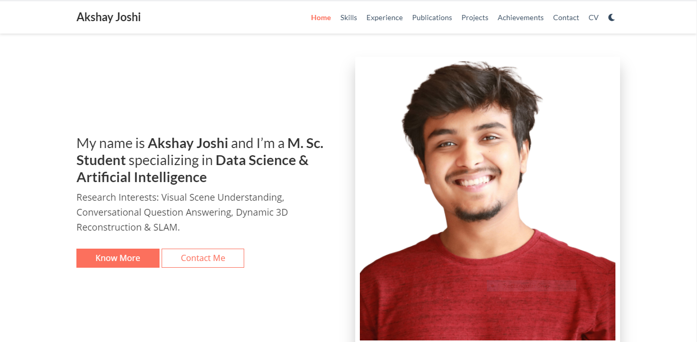

[<img src="https://github.com/akshayjoshii/akshayjoshii/raw/master/assets/captured.gif" alt="Hello" title="Hello"](https://akshayjoshi.tech)

## About Me
Graduate student with an extensive background in Semiconductors and Software Engineering R&D, currently pursuing research in 3D Scene Reconstruction, Neuro-Symbolic Reasoning, Self-supervised Learning and Multilingual Conversational Question Answering.

### Publications
|   Publication | Domain  | Contributors    |   Status  |
|-----------------|---------|-----------------|-----------|
|   [Dense Art Style Recognition with Self-supervised Ensemble of Auto-Encoding Transformations](https://github.com/akshayjoshii/Deep_Self-Supervised_Art_Style_Recognition)  |   Computer Vision, Self-Supervision |   [Akshay Joshi](https://akshayjoshi.tech/), [Ankit Agrawal](https://github.com/123ankitagr), [Sushmita Nair](https://github.com/sushmita-nair) |   In Progress |

### Featured Projects
|   Projects    |   Tech Stack  |   Contributors    |
|---------------|---------------|-------------------|
|   [Research Portfolio Website](https://github.com/akshayjoshii/akshayjoshii.github.io)    |   Hugo, HTML, CSS, JS, Markdown, Python, Netlify, Cloudflare, CI/CD   |   [Akshay Joshi](https://akshayjoshi.tech/)   |
|   [Covid-19 Tweets Sentiment & Exploratory Data Analysis](https://github.com/akshayjoshii/COVID19-Tweet-Sentiment-Analysis-and-EDA)   |   Python, NLTK, NumPy, Scikit-learn, XGBoost, PyTorch, Docker |   [Akshay Joshi](https://akshayjoshi.tech/)   |
|   [Event Driven Pedestrian & Vehicle Detection](https://github.com/akshayjoshii/Event-Driven-Pedestrian-Vehicle-Detection)  |   Python, YOLO, OpenCV, NumPy, Docker, TQDM   |   [Akshay Joshi](https://akshayjoshi.tech/), [Poojitha Vijayanarasimha](https://github.com/Poojithavijay) |
|   [Open Domain Question Answering with End-to-End Memory Networks](https://github.com/akshayjoshii/Open_Domain_Question_Answering)    |   Python, Keras, NLTK, Deep Neural Networks, NumPy, Knowledge Graphs  |   [Akshay Joshi](https://akshayjoshi.tech/)   |
|   [Spoken Language Recognition and Exploratory Data Analysis](https://github.com/akshayjoshii/Speech-Recognition) |   Python, Scikit-learn, NumPy, MatplotLib, SciPy  |   [Akshay Joshi](https://akshayjoshi.tech/)   |
|   [Multi-stage Information Retrieval & Ranking System](https://github.com/akshayjoshii/Statistical-NLP-Information-Retrieval-Project)  |  Python, NLTK, BeautifulSoup4, LXML, BM25, NumPy |   [Akshay Joshi](https://akshayjoshi.tech/)   |

### Research Portfolio

---
